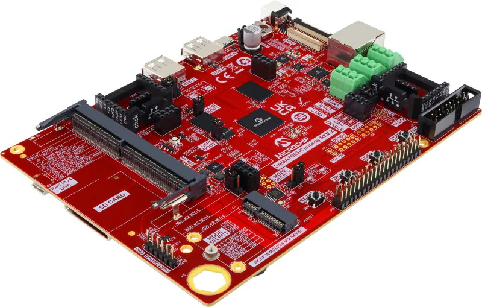
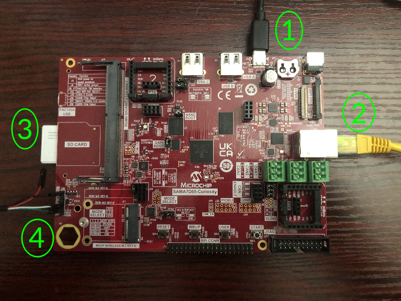
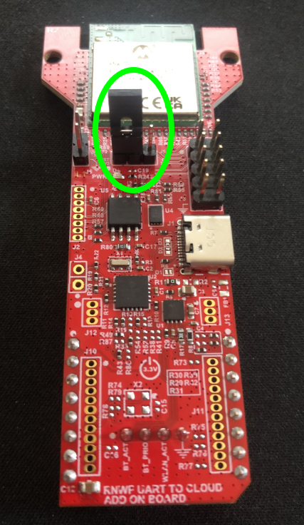
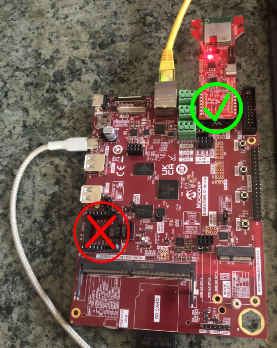

# Microchip SAMA7D65-Curiosity Kit + EV12H55A WiFi Module Quickstart
[Purchase Microchip EV63J76A (SAMA7D65 Curiosity Kit)](https://www.newark.com/microchip/ev63j76a/development-kit-arm-cortex-a7/dp/46AM2853) | [Purchase Microchip EV12H55A (RNWF11 WiFi Add-on Board)](https://www.microchipdirect.com/dev-tools/EV12H55A?allDevTools=true)
1. [Introduction](#1-introduction)
2. [Requirements](#2-requirements)
3. [Hardware Setup](#3-hardware-setup)
4. [Device Setup](#4-device-setup)
5. [Onboard Device](#5-onboard-device)
6. [Using the Demo](#6-using-the-demo)
7. [Resources](#7-resources)

# 1. Introduction

This guide provides step-by-step instructions to set up the **Microchip SAMA7D65-Curiosity Kit** with the
**EV12H55A WiFi Add-on Board** attached, and integrate it with **/IOTCONNECT**, Avnet's robust IoT platform.

> [!NOTE]
> This repo is a variant of the [Microchip SAMA7D65-Curiosity Kit quickstart](https://github.com/avnet-iotconnect/iotc-python-lite-sdk-demos/tree/main/microchip-sama7d65-curiosity)
> in the main [`iotc-python-lite-sdk-demos`](https://github.com/avnet-iotconnect/iotc-python-lite-sdk-demos) repo. Hardware setup, board imaging, and
> device onboarding are identical between the two guides. The difference is connectivity: that quickstart uses the
> board's Ethernet connection directly, while this one connects over the EV12H55A WiFi Add-on Board instead. The
> standard `iotconnect-sdk-lite` Python package is used unmodified — this demo just redirects its MQTT
> connection through the WiFi module's AT commands instead of a normal network socket.

<table>
  <tr>
    <td></td>
    <td>The SAMA7D65-Curiosity Kit is a development board for evaluating and prototyping with the Microchip SAMA7D65 microprocessor (MPU).
The SAMA7D65 MPU is a high-performance ARM Cortex-A7 CPU-based embedded MPU running up to 1GHz. The board allows
evaluation of powerful peripherals for connectivity, audio and user interface applications, including MIPI-DSI and
LVDS w/ 2D graphics, dual Gigabit Ethernet w/ TSN and CAN-FD.</td>
  </tr>
</table>

> [!IMPORTANT]
> The EV12H55A WiFi module communicates over a UART using ASCII AT commands — it does not present itself to Linux as
> a standard network interface (there is no `wlan0`). The demo application in this repo talks to it directly via
> those AT commands for all network traffic: DNS resolution, HTTPS discovery/identity calls, and the MQTT connection.
> While it is required for the intial installation and setup steps, **an ethernet connection is not required at runtime.**

# 2. Requirements

## Hardware

* Microchip EV63J76A (SAMA7D65 Curiosity Kit) [Purchase](https://www.newark.com/microchip/ev63j76a/development-kit-arm-cortex-a7/dp/46AM2853) | [User Manual & Kit Contents](https://ww1.microchip.com/downloads/aemDocuments/documents/MPU32/ProductDocuments/UserGuides/SAMA7D65-Curiosity-Kit-User-Guide-DS50003806.pdf) | [All Resources](https://www.microchip.com/en-us/development-tool/EV63J76A)
* Microchip EV12H55A (RNWF11 "UART to Cloud" WiFi Add-on Board) [Purchase](https://www.microchipdirect.com/dev-tools/EV12H55A?allDevTools=true)
* Ethernet Cable (used for initial board setup; the demo application itself connects over WiFi)
* USB-C Cable (included in kit)
* Standard SD Card or Micro-SD Card with Standard-Size Adapter (included in kit)
* USB to TTL Serial 3.3V Adapter Cable (must be purchased separately,
  click [here](https://www.amazon.com/Serial-Adapter-Signal-Prolific-Windows/dp/B07R8BQYW1/ref=sr_1_1_sspa?dib=eyJ2IjoiMSJ9.FmD0VbTCaTkt1T0GWjF9bV9JG8X8vsO9mOXf1xuNFH8GM1jsIB9IboaQEQQBGJYV_o_nruq-GD0QXa6UOZwTpk1x_ISqW9uOD5XoQcFwm3mmgmOJG--qv3qo5MKNzVE4aKtjwEgZcZwB_d7hWTgk11_JJaqLFd1ouFBFoU8aMUWHaEGBbj5TtX4T6Z_8UMSFS4H1lh2WF5LRprjLkSLUMF656W-kCM4MGU5xLU5npMw.oUFW_sOLeWrhVW0VapPsGa03-dpdq8k5rL4asCbLmDs&dib_tag=se&keywords=detch+usb+to+ttl+serial+cable&qid=1740167263&sr=8-1-spons&sp_csd=d2lkZ2V0TmFtZT1zcF9hdGY&psc=1)
  to see the cable used by Avnet's engineer)

> [!NOTE]
> The USB to TTL Serial 3.3V Adapter Cable may require you to install a specific driver onto your host machine. The
> example cable linked above requires
> a [PL2303 driver](https://www.prolific.com.tw/us/showproduct.aspx?p_id=225&pcid=41).

## Software

* A serial terminal such as [TeraTerm](https://github.com/TeraTermProject/teraterm/releases)
  or [PuTTY](https://www.putty.org/)
* Flash Yocto Image to SD Card:
    1. [Click here](https://developerhelp.microchip.com/xwiki/bin/view/applications/linux4sam/Boards/sama7d65curiosity/)
       to get to the page to access the latest Yocto SD Card image for the SAMA7D65.
    2. Download the image.
    3. Follow the "Create a SD card with the demo" section of the instructions to flash the image to an SD card.

# 3. Hardware Setup

See the reference image below for cable connections.
<details>
<summary>Reference Image with Connections</summary>

</details>

Using the above image as reference, make the following connections:

1. Connect the included USB-C cable from your PC to the USB-C connector labeled **#1**.
2. Connect an Ethernet cable from your LAN (router/switch) to the Ethernet connector labeled **#2**.
3. Insert the SD card (or Micro-SD card with an adapter) into the slot labeled **#3**.
4. Connect your USB to TTL Serial 3.3V Adapter Cable to the appropriate pins on the J35 debug header labeled **#4**.

J35 Pinout: GND - OPEN - OPEN - RX - TX - OPEN

Color-coded connections from suggested USB to TTL adapter cable: BLACK - OPEN - OPEN - WHITE - GREEN - OPEN

> [!NOTE]
> If your USB to TTL adapter cable has one larger connector (usually all 6 pins) instead of individual wires, that is
> still fine as long as the GND, RX, and TX pins line up correctly. It should also be noted that usually on USB to TTL
> adapters, **the RX female slot should line up with the TX pin on the board (and vice versa).** If you are unsure, try
> RX-to-TX and TX-to-RX first and if the serial connection does not work, then try RX-to-RX and TX-to-TX.

## Attach the EV12H55A WiFi Module

The WiFi module is a mikroBUS™ "Click" board, so it plugs directly into one of the board's mikroBUS sockets — no
soldering required.

### Step 1: Set the module's power-source jumper

The WiFi module has its own 3-pin power-selection header (labeled **J5** on the module, not to be confused with
anything on the main board) that selects whether it draws 3.3V from a USB cable or from the mikroBUS connector.
Since we're powering it from the mikroBUS connector, the jumper cap must be moved to the position circled below.



> [!WARNING]
> These modules typically ship with the jumper in the *other* position (set up for USB power), which will **not**
> work for this setup — WiFi connectivity will silently fail with no obvious error. Check the jumper position
> against the photo above before continuing, even if you haven't touched it.

### Step 2: Attach the module to the mikroBUS1 connector

The board has two mikroBUS sockets (J25/mikroBUS1 and J26/mikroBUS2). **This module must be plugged into mikroBUS1**
(the socket nearest the Ethernet connectors) — mikroBUS2 will not work with the setup in this guide. Align the WiFi
module's pins with the mikroBUS1 socket as shown below (green check) and press it down firmly until it is fully
seated.



> [!NOTE]
> It's easy for one row of pins to sit slightly proud if the module goes in at a slight angle. Check
> that all 8 pins on both rows of the connector are fully inserted before powering on the board.

# 4. Device Setup

1. Open a serial terminal emulator program such as TeraTerm.
2. Ensure that your serial settings in your terminal emulator are set to:

- Baud Rate: 115200
- Data Bits: 8
- Stop Bits: 1
- Parity: None

3. Noting the new COM port in your Device Manager list, attempt to connect to your board via
   the terminal emulator

> [!NOTE]
> A successful connection may result in just a blank terminal box. If you see a blank terminal box, press the ENTER key
> to get a login prompt. An unsuccessful connection attempt will usually result in an error window popping up.

4. When prompted for a login, type `root` followed by the ENTER key.
5. Run this command to update the core board packages:

```
sudo opkg update
```

> [!TIP]
> To gain access to "copy" and "paste" functions inside of a PuTTY terminal window, you can CTRL+RIGHTCLICK within the
> window to utilize a dropdown menu with these commands. This is very helpful for copying/pasting between your browser and
> the terminal.

## Enable the WiFi Module's UART

The mikroBUS1 RX/TX pins are not enabled as a UART by default — out of the box, the board's device tree leaves them
unconfigured. The demo package includes a device tree overlay and a setup script that enables them permanently.

1. On the board, download and extract the demo package:

   ```
   mkdir -p /opt/demo && cd /opt/demo
   wget -O demo.zip https://avnetpublicaccess.s3.us-east-1.amazonaws.com/wifi-module-src.zip
   unzip demo.zip
   bash install.sh
   ```

2. Run the setup script:

   ```
   python3 /opt/demo/apply_wifi_overlay.py
   ```

   This backs up the board's existing boot environment, patches it to load the WiFi UART overlay on every boot, and
   copies the overlay file onto the boot partition.

3. Power-cycle the board (unplug and replug the USB-C power cable — a soft reset is not enough). After it boots back
   up, confirm the new serial port exists:

   ```
   ls /dev/ttyS1
   ```

   If `/dev/ttyS1` exists, the UART is enabled and ready to talk to the module.

> [!TIP]
> If you ever need to undo this change, the original boot environment was backed up to `/uboot.env.bak` on the boot
> partition before it was modified.

# 5. Onboard Device

The next step is to onboard your device into /IOTCONNECT. This will be done via the online /IOTCONNECT user interface.

> [!IMPORTANT]
> The onboarding script will detect that `app.py` already exists in `/opt/demo` and ask whether you want to overwrite
> it. Enter **`n`** to keep the existing file — the WiFi module version of `app.py` installed in the previous step
> must not be replaced.

Follow [this guide](https://github.com/avnet-iotconnect/iotc-python-lite-sdk-demos/blob/main/common/general-guides/UI-ONBOARD.md) to walk you through the process.

> [!TIP]
> If you have obtained a solution key for your /IOTCONNECT account from Softweb Solutions, you can utilize the /IOTCONNECT
> REST API to automate the device onboarding process via shell scripts. Check out [this guide](https://github.com/avnet-iotconnect/iotc-python-lite-sdk-demos/blob/main/common/general-guides/REST-API-ONBOARD.md)
> for more info on that.

# 6. Using the Demo

The demo files were already extracted to `/opt/demo` during the WiFi UART setup in the previous section. The only
remaining step before running is to create your WiFi credentials file:

```
cp /opt/demo/wifi_config.json.example /opt/demo/wifi_config.json
nano /opt/demo/wifi_config.json
```

> [!NOTE]
> You don't need to look up the network's security type yourself — the app scans for it automatically the first
> time it joins.

> [!TIP]
> At this point the Ethernet cable is no longer needed. You can unplug it now — the app routes all network traffic
> (DNS, HTTPS, and MQTT) through the WiFi module and does not use the board's Ethernet interface at runtime.

Run the demo with this command:

```
python3 app.py
```

> [!NOTE]
> Always make sure you are in the ```/opt/demo``` directory before running the demo. You can move to this
> directory with the command: ```cd /opt/demo```

On startup, the app joins your WiFi network through the module, then routes all network traffic through it: DNS
resolution, HTTPS calls to the /IOTCONNECT discovery and identity APIs, and the MQTT connection. No Ethernet cable
is needed at runtime. View the random-integer telemetry data under the "Live Data" tab for your device on /IOTCONNECT.

# 7. Resources

* [Purchase the Microchip EV63J76A (SAMA7D65 Curiosity Kit)](https://www.newark.com/microchip/ev63j76a/development-kit-arm-cortex-a7/dp/46AM2853)
* [Purchase the Microchip EV12H55A (RNWF11 WiFi Add-on Board)](https://www.microchipdirect.com/dev-tools/EV12H55A?allDevTools=true)
* [More /IOTCONNECT Microchip Guides](https://avnet-iotconnect.github.io/partners/microchip/)
* [/IOTCONNECT Overview](https://www.iotconnect.io/)
* [/IOTCONNECT Knowledgebase](https://help.iotconnect.io/)
