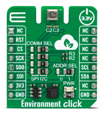
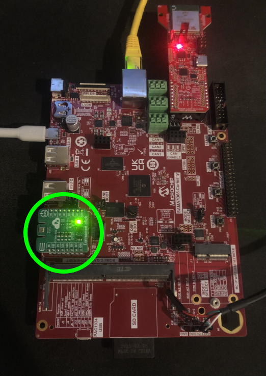

# Environmental Data Expansion Demo

Upgrades this repo's WiFi quickstart demo on the Microchip SAMA7D65-Curiosity Kit to read real temperature, humidity,
pressure, and gas (VOC) data from a [MikroE Environment Click](https://www.mikroe.com/environment-click)
(Bosch BME680) board and publish it as telemetry to /IOTCONNECT, in place of the quickstart's random-integer
telemetry. The EV12H55A WiFi Add-on Board stays attached and continues to provide connectivity — this demo only
changes what data gets sent, not how it gets there.



> [!IMPORTANT]
> Complete the [quickstart guide](../README.md) for this repo first, including the WiFi module setup. This guide
> assumes the EV12H55A WiFi Add-on Board is already seated in mikroBUS1 (J25) and working.

1. [Introduction](#1-introduction)
2. [Additonal Hardware Setup](#2-additional-hardware-setup)
3. [Download and Install the Package](#3-download-and-install-the-package)
4. [Enable the mikroBUS2 I2C Bus](#4-enable-the-mikrobus2-i2c-bus)
5. [Change Device Template](#5-change-device-template)
6. [Run the Demo](#6-run-the-demo)
7. [Customize and Redeploy the Package](#7-customize-and-redeploy-the-package)
8. [Telemetry](#8-telemetry)
9. [Resources](#9-resources)

# 1. Introduction

The board has two mikroBUS™ Click sockets (see the quickstart's hardware setup step). The EV12H55A WiFi module
occupies mikroBUS1. The Environment Click plugs into the other one, mikroBUS2 (J26), and communicates with the
SAMA7D65 over I2C.

The Environment Click carries a Bosch **BME680** environmental sensor, a 4-in-1 digital sensor that measures:

* Temperature
* Relative humidity
* Barometric pressure
* Gas resistance (an indicator of VOC/air-quality changes — not a calibrated ppm reading)

# 2. Additional Hardware Setup

With the WiFi module already seated in mikroBUS1 from the quickstart guide, plug the Environment Click into
**mikroBUS2** as shown here:



Align the Click board's pins with the socket and press it down firmly until fully seated.

> [!NOTE]
> An Ethernet connection is required to complete package downloads and installation in Step 3. After Step 3 is complete,
> the Ethernet connection is no longer required.

# 3. Download and Install the Package

On the board, run:

```bash
cd /opt/demo
wget -O environmental-data-src.zip https://avnetpublicaccess.s3.us-east-1.amazonaws.com/environmental-data-src.zip
unzip -o environmental-data-src.zip
bash ./install.sh
```

> [!IMPORTANT]
> Installation will ask whether to overwrite the existing `app.py`. Enter **`y`** to patch over the
> WiFi-only quickstart version.

This lands `apply_environment_overlay.py`, `sama7d65_curiosity_environment_click2.dtbo`, `app.py`, and the rest of
this demo's files in `/opt/demo`, alongside the quickstart's existing files.

# 4. Enable the mikroBUS2 I2C Bus

Just like mikroBUS1's UART, mikroBUS2's I2C pins are not enabled by default — the board's device tree leaves the
FLEXCOM peripheral behind them unconfigured out of the box. The package you just installed includes a second device
tree overlay and setup script that enables it permanently, alongside the WiFi overlay from the quickstart.

1. Run the setup script:

   ```
   python3 /opt/demo/apply_environment_overlay.py
   ```

   This patches the board's saved boot environment to load *both* the WiFi UART overlay and the new I2C overlay on
   every boot, and copies the new overlay file onto the boot partition. It's safe to run regardless of whether the
   WiFi overlay was applied first — it rewrites the full boot sequence rather than assuming the prior state.

2. Power-cycle the board by unplugging and replugging the USB-C power cable — **a soft reset/reboot is not enough**.

# 5. Change Device Template

Change your device's template to `sama7d65-env-data` in the /IOTCONNECT online platform:

1. Open [console.iotconnect.io](https://console.iotconnect.io) and navigate to your device's page.
2. Locate the **Template** field (mid-left on the page) and click the edit icon.
3. Select the `sama7d65-env-data` template from the drop-down and save.

> [!TIP]
> If the `sama7d65-env-data` template is not yet present in your /IOTCONNECT instance, import it from
> [environmental-data-template.json](./environmental-data-template.json) via **Templates → Create Template → Import**.

# 6. Run the Demo

```bash
cd /opt/demo
python3 app.py
```

The application connects to WiFi through the RNWF11 module exactly as the quickstart does, initializes the
Environment Click over I2C, then reads and publishes all four measurements every 10 seconds. View the readings
under the **Live Data** tab for your device on /IOTCONNECT.

# 7. Customize and Redeploy the Package

If you want to modify this demo — change the telemetry logic in `app.py`, tweak the BME680's oversampling/heater
settings in `environment_click.py`, add more source files, etc. — you can rebuild and redeploy the package yourself.

> [!IMPORTANT]
> The prebuilt `environmental-data-src.zip` used in [step 3](#3-download-and-install-the-package) is hosted in
> Avnet's own S3 bucket, which you don't have upload access to. A package you rebuild locally has to be delivered to
> the board directly (over SCP) rather than via that `wget` URL — the steps below cover that.

1. **Make your changes.** In your local clone of this repo, edit files in `environmental-data/src/` (or add new
   ones). This is the same directory that gets zipped up into the package.

2. **Rebuild the package.** From the `environmental-data` directory, run:

   ```bash
   cd environmental-data
   bash ./create-package.sh
   ```

   This produces `environmental-data-src.zip` in the `environmental-data` directory (and a copy in
   `environmental-data/packages/`).

3. **Copy it to the board.** Find your board's IP address, then `scp` the archive directly into `/opt/demo`:

   ```bash
   scp environmental-data-src.zip root@<BOARD_IP>:/opt/demo/
   ```

4. **Extract and install on the board.** SSH in and run the same install steps [step 3](#3-download-and-install-the-package)
   used, minus the `wget`:

   ```bash
   ssh root@<BOARD_IP>
   cd /opt/demo
   unzip -o environmental-data-src.zip
   bash ./install.sh
   ```

   `unzip -o` overwrites the existing files in `/opt/demo`, including `app.py`, without prompting. Then run it as
   usual:

   ```bash
   python3 app.py
   ```

# 8. Telemetry

| Field | Unit | Description |
|-------|------|--------------|
| `sdk_version` | - | /IOTCONNECT Python Lite SDK version string |
| `temperature_c` | °C | Ambient temperature |
| `humidity_rh` | %RH | Relative humidity |
| `pressure_hpa` | hPa | Barometric pressure |
| `gas_resistance_ohms` | Ω | Gas sensor resistance (higher = cleaner air); omitted until the heater stabilizes after startup |

> [!NOTE]
> `gas_resistance_ohms` is omitted from telemetry messages for the first several readings after startup while the
> BME680's gas heater stabilizes -- the template defines it as an optional attribute, so those early messages are
> expected to show it as `null` rather than indicating a problem.

# 9. Resources

* [MikroE Environment Click Product Page](https://www.mikroe.com/environment-click)
* [Environment Click Datasheet](https://www.mikroe.com/environment-click#/263-clickid-yes)
* [Bosch BME680 Product Page](https://www.bosch-sensortec.com/products/environmental-sensors/gas-sensors-bme680/)
* [/IOTCONNECT Quickstart for this Repo](../README.md)
* [/IOTCONNECT Overview](https://www.iotconnect.io/)
* [/IOTCONNECT Knowledgebase](https://help.iotconnect.io/)
